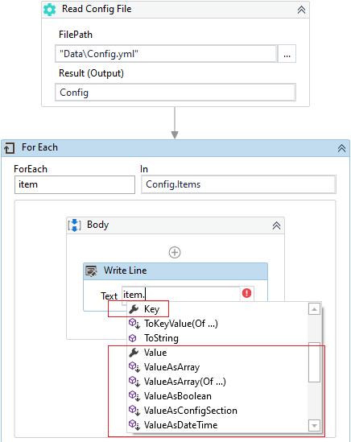
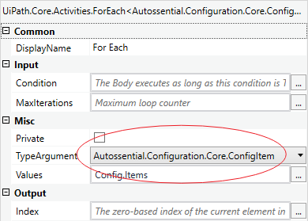

A class that stores the key-value pair from the configuration files.

Each entry in a *ConfigSection* is a *ConfigItem*.

E.g:

```yaml
retries: 5 # ConfigItem (Key: retries, Value: 5)
screenshots: true # ConfigItem (Key: screenshots, Value: true)

letters: # ConfigItem (Key: letters, Value: ConfigSection)
    A-E: ABCDE # ConfigItem (Key: A-E, Value: ABCDE)
```

##### Methods

|         Name         |                       Description                       |
| -------------------- | ------------------------------------------------------- |
| ValueAsString        | Retrieves a value as System.String                      |
| ValueAsInt           | Retrieves a value as System.Int32                       |
| ValueAsDouble        | Retrieves a value as System.Double                      |
| ValueAsDecimal       | Retrieves a value as System.Decimal                     |
| ValueAsFloat         | Retrieves a value as System.Float                       |
| ValueAsLong          | Retrieves a value as System.Int64                       |
| ValueAsDateTime      | Retrieves a value as System.DateTime                    |
| ValueAsBoolean       | Retrieves a value as System.Boolean                     |
| ValueAsArray         | Retrieves a value as an array of objects (`object[]`)   |
| ValueAsArray&lt;T>   | Retrieves a value as an array of the specified type T   |
| ValueAsList          | Retrieves a value as a list of objects (`List<object>`) |
| ValueAsList&lt;T>    | Retrieves a value as a list of the specified type T     |
| ValueAsConfigSection | Retrieves a value as a ConfigSection (aka Sub-Sections) |


All items of a specific *ConfigSection* can be retrieved using *ConfigSection.Items*. E.g:



Make sure to select the ConfigItem as TypeArgument on ForEach activity:


