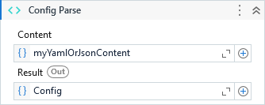

Converts the text content in a ConfigSection object.

##### Properties

|Name   |Description                                 |
|-------|--------------------------------------------|
|Content|Text content well formatted in YAML or JSON.|
|Result |The ConfigSection object.                   |

