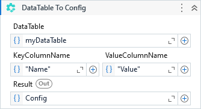

Generates a new ConfigSection based on the specified DataTable.

##### Properties

|Name           |Description                                                     |
|---------------|----------------------------------------------------------------|
|DataTable      |The DataTable where to read the configuration from.             |
|KeyColumnName  |The column in DataTable that will be use as configuration key.  |
|Result         |The ConfigSection object.                                       |
|ValueColumnName|The column in DataTable that will be use as configuration value.|

