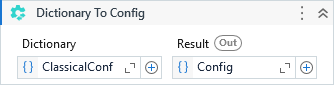

Generates a new ConfigSection based on the specified Dictionary.

##### Properties

|Name      |Description                                         |
|----------|----------------------------------------------------|
|Dictionary|The Dictionary where to read the configuration from.|
|Result    |The ConfigSection object.                           |

