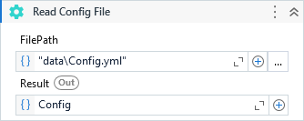

Generates a new ConfigSection based on the configuration file path.

##### Properties

|Name    |Description                                        |
|--------|---------------------------------------------------|
|FilePath|The file path where to read the configuration from.|
|FileType|The content file type of the configuration file.   |
|Result  |The ConfigSection object.                          |

