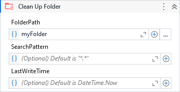

{{activity-description}}

##### Properties

{{activity-properties}}

##### Usage

The activity deletes all files and folders that exists on the specified folder to clean up.

We can keep the folder structure by unchecking the property `DeleteEmptyFolders`, so the folders will not be deleted.

By specifying a `SearchPattern` we can delete only the files with specific names or extensions.

Finally, use `LastWriteTime` property to delete the files create/modified till the specified date.