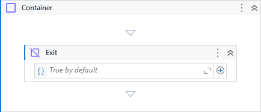

{{activity-description}}

##### Properties

{{activity-properties}}

##### Usage

This activity behaves on the same way as <a href="https://docs.microsoft.com/en-US/dotnet/api/system.activities.statements.sequence?view=netframework-4.8" target="_blank" title="Microsoft Documentation">Sequence</a> activity if not combined with [Exit](Exit.md) activity.

Container and Exit was designed to be used together and can help us to design cleaner workflows in many different situations, especially to avoid nested conditional Ifs.

Lets consider the below code:

Considering the example, only the messages *"First"* and *"Third"* will be printed out.

When we reach the **Exit** activity, the condition tells to **Container** interrupt its execution. Then, the process flow continues to the next activity.

Below is an abstraction of what happens to the execution flow:

A very common situation is when we have nested Ifs where a condition depends on the previous condition.

E.g: Condition3 depends on Condition2 that depends on Condition1 and each one has its own logic/rules/procedures etc.

Below are the implementation using three different ways:

=== "Sequence"

    

=== "Flowchart"

    

=== "Container & Exit"

    

        

        

            Explaining...
            <ol>
                <li>**Exit** from the **Container** if *Condition1* is not true.</li>
                <li>Execute the *Condition1* logic.</li>
                <li>**Exit** from the **Container** if *Condition2* is not true.</li>
                <li>Execute the *Condition2* logic.</li>
                <li>**Exit** from the **Container** if *Condition3* is not true.</li>
                <li>Execute the *Condition3* logic.</li>
            </ol>
        

    

!!! info "Related Activies"
    - [Exit](Exit.md) 
    - [Iterate](Iterate.md)
    - [Next](Next.md)    
    - [TimeLoop](Time%20Loop.md)