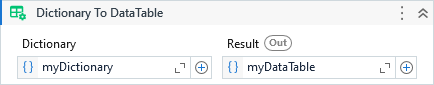

{{activity-description}}



##### Properties

{{activity-properties}}

##### Usage

When converting the Dictionary to DataTable, the dictionary keys become the column names and the dictionary values become the first row of the data table.

e.g:

```C#
Dictionary<string, object>
{
    {"Name", "Autossential"},
    {"Year", 2021},
    {"Tool", "UiPath"}
}
```

Results in the DataTable:

|     Name     | Year |  Tool  |
| ------------ | ---- | ------ |
| Autossential | 2021 | UiPath |