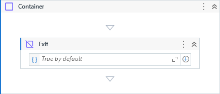

{{activity-description}}

##### Properties

{{activity-properties}}

##### Usage

The activity can be used inside a **Container**, **Iterate** or **Time Loop** activities.

We can use the property `Condition` by providing a boolean expression or variable to determine if the execution should exit immediately from the mentioned activities.

If the `Condition` is not specified, it is `True` by default.

!!! info "Related Activies"
    - [Container](Container.md)
    - [Iterate](Iterate.md)
    - [Next](Next.md)    
    - [TimeLoop](Time%20Loop.md)