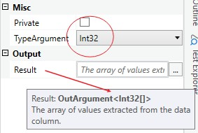

{{activity-description}}


##### Properties

{{activity-properties}}

##### Usage

Considering below DataTable:

| Name | Age | Country |
| ---- | --- | ------- |
| John | 41  | US      |
| Ana  | 35  | RU      |
| Alex | 38  | BR      |

To extract all values from column "Age" you can pass the column name "Age" or its index 1. 

```[41, 35, 38]```

By default all values are extract as objects resulting in array of objects `object[]`.

In this example, we can specify the type to `Int32` to get an array of integers `Int32[]`



In some scenarios we can have null values.

| Name | Age | Country |
| ---- | --- | ------- |
| John | 41  | US      |
| Ana  |     | RU      |
| Alex | 38  | BR      |

By default, the activity will resolve it using the default value of the specified type, e.g `default(Int32)`, which in this case will return in zero.

`[41, 0, 38]`

You can use an alternative value by specifying it on `DefaultValue` property. Read more on the properties table above.


