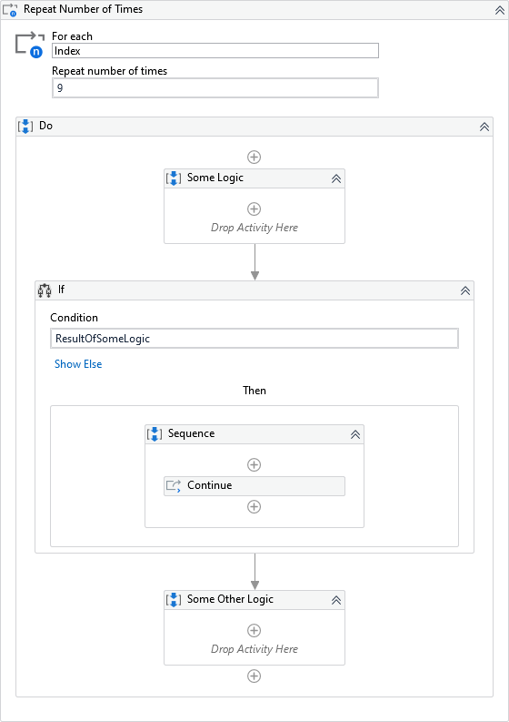
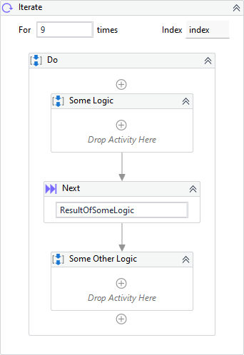

{{activity-description}}


##### Properties

{{activity-properties}}

##### Usage

The activity is the same as a *for loop* in many languages, e.g in C#:

``` csharp
for (int i = 0; i < 10; i++)
{
    // Do...
}
```

We can use the [Next](Next.md) activity to reproduce the `continue` feature which moves the process to next iteration:

``` csharp
for (int i = 0; i < 10; i++)
{
    // ...

    continue;

    // ...
}
```

And finally, we can use the [Exit](Exit.md) activity to reproduce the `break` feature interrupting the *for loop*:

``` csharp
for (int i = 0; i < 10; i++)
{
    // ...

    break;

    // ...
}
```

See below a comparison of Iterate and the UiPath's equivalent activity.

=== "Repeat Number Of Times"

    

=== "Iterate"

    


!!! info "Related Activies"
    - [Container](Container.md)
    - [Exit](Exit.md) 
    - [Next](Next.md)    
    - [TimeLoop](Time%20Loop.md)