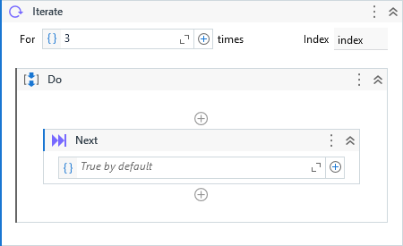

{{activity-description}}



##### Properties

{{activity-properties}}

##### Usage

This activity can be only used inside the **Iterate** or **Time Loop** activities and it is equivalent to `continue` in a for loop, e.g in C#:


``` csharp
for (int i = 0; i < 10; i++)
{
    // ...

    continue;
    
    // ...
}
```

We can use the property `Condition` by providing a boolean expression or variable to determine if the should move to next iteration.

If not specified anything to `Condition`, it assumes `True` by default.

!!! info "Related Activies"
    - [Exit](Exit.md) 
    - [Iterate](Iterate.md)
    - [Next](Next.md)    
    - [TimeLoop](Time%20Loop.md)