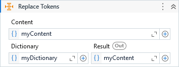

{{activity-description}}



##### Properties

{{activity-properties}}

##### Usage

Lets consider the email template as content:

> *Dear <span class="red"></span>,*

> *The <span class="red"></span> ran successfully today (<span class="red"></span>).*

> *The consolidated report can be found attached.*

> *Regards,*<br/>*<span class="red"></span>*

And the below dictionary for token replacement:

```C#
Dictionary<string, object>
{
    {"Business", "John Connor"},
    {"ProcessName", "Terminator Bot"},
    {"DateTime", "02-Jul-2022"},
    {"ProcessTeam", "Resistence"}
}
```

The output results:

> *Dear John Connor,*

> *The Terminator Bot ran successfully today (02-Jul-2022).*

> *The consolidated report can be found attached.*

> *Regards,*<br/>*Resistence*