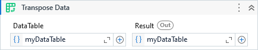

{{activity-description}}

##### Properties

{{activity-properties}}

##### Usage

Transforms the columns of the input data table:

| Product | Quantity | Color  |
| ------- | -------- | ------ |
| A       | 10       | Green  |
| B       | 20       | Blue   |
| C       | 30       | Yellow |
| D       | 40       | Orange |

In rows of the output data table:

|   Col1   | Col2  | Col3 |  Col4  |  Col5  |
| -------- | ----- | ---- | ------ | ------ |
| Product  | A     | B    | C      | D      |
| Quantity | 10    | 20   | 30     | 40     |
| Color    | Green | Blue | Yellow | Orange |

!!! tip
    We can combine it with [Promote Headers](./Promote Headers.md) to remove the auto-generated header.
