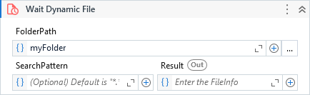

{{activity-description}}

##### Properties

{{activity-properties}}
    
##### Usage

We can use this activity when we need to wait for a file be available which we *don't know* what is the file name.

The activity monitors a specific folder and as soon as a file become available considering all parameters specified in the activity, it returns the information of the file.

!!! note
    For files that you **can** determine the name, [Wait File](Wait File.md) suits better.