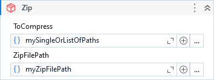

{{activity-description}}

##### Properties

{{activity-properties}}

##### Usage

You can specify a single or multiple files and folders to be compressed on `.ToCompress` property:

Compressing specific files:

- `"C:\Temp\file1.docx"`
- `{ "C:\Temp\file1.docx", "C:\Temp\file2.xlsx" }`

Compressing folders:

- `"C:\Temp\Documents"`
- `{ "C:\Temp\Documents", "C:\Temp\Images", "C:\Temp\Musics" }`

Mixing Files and Folders:

- ` { "C:\Temp\file1.docx", "C:\Temp\Musics", "C:\Temp\Images\avagar.png" }`