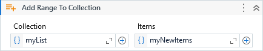

Adds a set of items to the specified collection.

##### Properties

|Name      |Description                             |
|----------|----------------------------------------|
|Collection|The collection you want to modify.      |
|Items     |The items to be added to the collection.|

