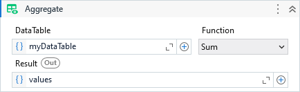
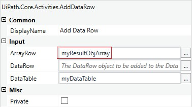

Aggregates the DataTable data by the specified function resulting in a DataRow, product of this aggregation.

##### Properties

|Name     |Description                                                                                                                            |
|---------|---------------------------------------------------------------------------------------------------------------------------------------|
|Columns  |The column indexes or column names to apply the aggregation. If not specified, the aggregation will be applied in all possible columns.|
|Function |The aggregate function.                                                                                                                |
|DataTable|The data table which the aggregate function will be applied.                                                                           |
|Result   |An object array containing the result of the aggregation.                                                                              |

!!! note
    Some aggregate functions are applied just to numeric values while others are applied to all value types, e.g. DistinctCount.

##### Usage

Let's consider the below input DataTable for instance:

| Product | Quantity | Total  |  ID  |
| ------- | -------: | -----: | ---: |
| P-001   |     1000 | 200.25 |  754 |
| P-002   |     1000 | 300.50 |  833 |
| P-003   |      500 | 400.00 |  212 |

Below is the result of **Sum** and **DistinctCoun**t aggregations:

|     Function      |   Result (Object's Array)    |
| :---------------: | ---------------------------- |
|      **Sum**      | ``[ , 2500, 900.75, 1799 ]`` |
| **DistinctCount** | ``[ 3, 2, 3, 3 ]``           |

Note that for **Sum** aggregation, only columns with numeric values has results. 
Columns that can't be aggregate by some Function result in *null* values.

We can target specific columns by using the **Columns** property. 
For example, setting the value to: ``{"Quantity", "Total Price"}`` or ``{2, 3}``, only these columns are affected:

``[ , 2500, 900.75, ]``

The result output is an array of objects.

So, if we want add it back to the DataTable as a summary row, just pass it to *ArrayRow* property of the UiPath's Add Data Row Activity.

