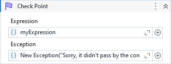

Checks if a given expression is true, if not, thrown the specified exception.

##### Properties

|Name      |Description                                                                                          |
|----------|-----------------------------------------------------------------------------------------------------|
|Data      |A collection of key/value pairs that provide additional user-defined information about the exception.|
|Exception |The exception to thrown if the expression is not true.                                               |
|Expression|The expression to be evaluated.                                                                      |

