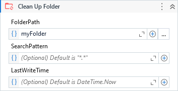

Deletes all files and folders from a specified folder.

##### Properties

|Name              |Description                                                                                                                                                                                                                                                                                                                                                |
|------------------|-----------------------------------------------------------------------------------------------------------------------------------------------------------------------------------------------------------------------------------------------------------------------------------------------------------------------------------------------------------|
|ContinueOnError   |If set, continue executing the remaining activities even if the current activity has failed.                                                                                                                                                                                                                                                               |
|DeleteEmptyFolders|Determines if the left empty folders after files deletion must also be deleted.                                                                                                                                                                                                                                                                            |
|FolderPath        |The folder path to be cleaned up.                                                                                                                                                                                                                                                                                                                          |
|LastWriteTime     |Deletes only the files with last write time till this reference date. Default is DateTime.Now.                                                                                                                                                                                                                                                             |
|Result            |An object containing the number of files deleted, folders deleted and total deleted.                                                                                                                                                                                                                                                                       |
|SearchOption      |Specifies whether the search operation should include only the current directory or should include all subdirectories.                                                                                                                                                                                                                                     |
|SearchPattern     |The search string to match against the names of files in path. This parameter can contain a combination of valid literal path and wildcard (\* and ?) characters, but it doesn't support regular expressions. It supports a string or a collection of strings. Default value is all files (\*.\*). The features can be extended by SearchPatternMode property.|
|SearchPatternMode |Native: applies the search pattern using the native standards. Extended: allows the use of an additional wildcard (!) to create negative patterns, e.g: (!\*.txt) means to match everything except (\*.txt) files. Complete: It also allows negative patterns and perform the testing in the full file path instead of only in the file name.              |

##### Usage

The activity deletes all files and folders that exists on the specified folder to clean up.

We can keep the folder structure by unchecking the property `DeleteEmptyFolders`, so the folders will not be deleted.

By specifying a `SearchPattern` we can delete only the files with specific names or extensions.

Finally, use `LastWriteTime` property to delete the files create/modified till the specified date.
