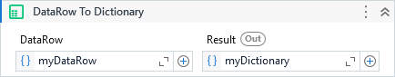

Converts a DataRow to Dictionary.

##### Properties

|Name   |Description           |
|-------|----------------------|
|DataRow|The input DataRow.    |
|Result |The output Dictionary.|

##### Usage

When we need to iterate through a DataTable rows and add them to an Orchestrator Queue we can convert each DataRow to Dicionary and then, pass it to *.ItemInformationCollection* property of the UiPath's *AddQueueItem* activity.
