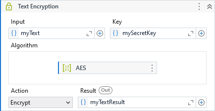

Provides methods to encrypt or decrypt the values of a DataTable using a specified algorithm and key.

##### Properties

|Name              |Description                                                                                                                                                                                                                                                                     |
|------------------|--------------------------------------------------------------------------------------------------------------------------------------------------------------------------------------------------------------------------------------------------------------------------------|
|Action            |Determines if is to encrypt or decrypt the input value.                                                                                                                                                                                                                         |
|Columns           |The column indexes or column names to be decrypted.                                                                                                                                                                                                                             |
|Input             |The DataTable to encrypt or decrypt.                                                                                                                                                                                                                                            |
|Key               |The key to be use. Can be a string or a SecureString.                                                                                                                                                                                                                           |
|ParallelProcessing|Uses parallel processing to scan through the DataTable and decrypt the data. Although this can drastically increase the processing speed, the rows in the resulting DataTable may have its order changed. Combine it with Sort property to reorder the DataTable when necessary.|
|Result            |The encrypted or decrypted DataTable.                                                                                                                                                                                                                                           |
|Sort              |Sets the sort column or columns, and sort order for the output DataTable. The value must be a string that contains the column name followed by "ASC" (ascending) or "DESC" (descending). Columns are sorted ascending by default. Multiple columns can be separated by commas.  |
|TextEncoding      |The encoding used to interpret the data and key.                                                                                                                                                                                                                                |

