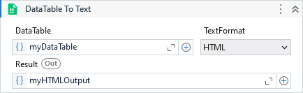

Returns a string representation of a datatable on the specified text format (HTML, JSON or XML).



##### Properties

|Name          |Description                                                                       |
|--------------|----------------------------------------------------------------------------------|
|DateTimeFormat|The date format to be used on the string representation for DateTime column types.|
|DataTable     |The DataTable.                                                                    |
|Result        |The string representation of the DataTable.                                       |
|TextFormat    |The text format.                                                                  |


##### Usage

Considering the following DataTable:

| Name | Value |
| ---- | ----- |
| A    | 1     |
| B    | 2     |
| C    | 3     |

These are the results for each TextFormat selected.

**HTML**

```html
<table>
 <thead>
  <tr>
   <th>Name</th>
   <th>Value</th>
  </tr>
 </thead>
 <tbody>
  <tr>
   <td>A</td>
   <td>1</td>
  </tr>
  <tr>
   <td>B</td>
   <td>2</td>
  </tr>
  <tr>
   <td>C</td>
   <td>3</td>
  </tr>
 </tbody>
</table>
```

**JSON**

```json
[{"Name":"A","Value":1},{"Name":"B","Value":2},{"Name":"C","Value":3}]
```

**XML**


```xml
<DocumentElement>
 <DataTable>
  <Name>A</Name>
  <Value>1</Value>
 </DataTable>
 <DataTable>
  <Name>B</Name>
  <Value>2</Value>
 </DataTable>
 <DataTable>
  <Name>C</Name>
  <Value>3</Value>
 </DataTable>
</DocumentElement>
```
