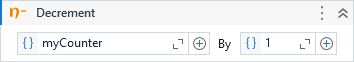

Decrements the value of a variable by the specified decrement value.

##### Properties

|Name    |Description               |
|--------|--------------------------|
|Value   |The decrement value.      |
|Variable|The variable to decrement.|

