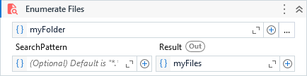

Returns an enumerable collection of full file names that match a search pattern (or collection of patterns) and enumeration options in a specified path (or collection of paths).

##### Properties

|Name             |Description                                                                                                                                                                                                                                                                                                                                                |
|-----------------|-----------------------------------------------------------------------------------------------------------------------------------------------------------------------------------------------------------------------------------------------------------------------------------------------------------------------------------------------------------|
|DirectoryPath    |The relative or absolute path (or collection of paths) to the directory (or directories) to search.                                                                                                                                                                                                                                                        |
|Exclusions       |Excludes from the enumeration the files with any of the specified attributes.                                                                                                                                                                                                                                                                              |
|Result           |An enumerable collection of the full names (including paths) for the files in the directory specified by path and that match the specified search pattern and option.                                                                                                                                                                                      |
|SearchOption     |Specifies whether the search operation should include only the current directory or should include all subdirectories.                                                                                                                                                                                                                                     |
|SearchPattern    |The search string to match against the names of files in path. This parameter can contain a combination of valid literal path and wildcard (\* and ?) characters, but it doesn't support regular expressions. It supports a string or a collection of strings. Default value is all files (\*.\*). The features can be extended by SearchPatternMode property.|
|SearchPatternMode|Native: applies the search pattern using the native standards. Extended: allows the use of an additional wildcard (!) to create negative patterns, e.g: (!\*.txt) means to match everything except (\*.txt) files. Complete: It also allows negative patterns and perform the testing in the full file path instead of only in the file name.              |

##### Usage

Returns a `IEnumerable<string>` with all file paths from the specified directory or directories.

Use the `SearchPattern` to filter the files by its name or extension.
