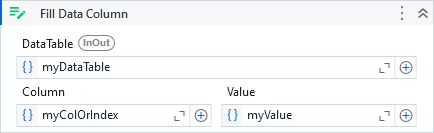

Fills all rows of a data table column with the specified value.

##### Properties

|Name     |Description                                                                                                                                                                                   |
|---------|----------------------------------------------------------------------------------------------------------------------------------------------------------------------------------------------|
|Column   |The column name or column index that is going to be updated.                                                                                                                                  |
|DataTable|The data table containing the column that is going to be updated.                                                                                                                             |
|Value    |The value assigned to all rows of the data table column. The value will default to DBNull if no value is provided, which in this scenario, requires a column configured to accept null values.|

