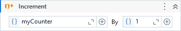

Increments the value of a variable by the specified increment value.

##### Properties

|Name    |Description                    |
|--------|-------------------------------|
|Value   |The increment value.           |
|Variable|The variable to be incremented.|

