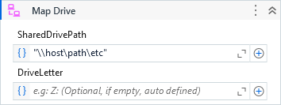

Maps a Network Drive into the system.

##### Properties

|Name           |Description                                                                                                                                                      |
|---------------|-----------------------------------------------------------------------------------------------------------------------------------------------------------------|
|Credential     |The credential to be used for the drive mapping.                                                                                                                 |
|DriveLetter    |The drive letter to be mapped, if not specified, a random one will be chosen. When specifing, the valid inputs are 'X', 'X:' or 'X:\', where X can be any letter.|
|Force          |Tries to force the connection if the drive letter is already being in use.                                                                                       |
|MappedDrive    |The mapped drive letter if the mapping was successful, it is represented in the format "&lt;letter>:\".                                                          |
|ResponseCode   |The response code of the WNetAddConnection2A.                                                                                                                    |
|ResponseMessage|The equivalent response message of the response code.                                                                                                            |
|Result         |Returns true if the drive was successfully mapped, false otherwise.                                                                                              |
|SharedDrivePath|The shared drive path to connect with.                                                                                                                           |

