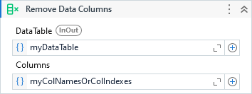

Removes the specified columns from a DataTable

##### Properties

|Name     |Description                                                                                   |
|---------|----------------------------------------------------------------------------------------------|
|Columns  |The column names or column indexes to be removed. Can be either a collection of string or int.|
|DataTable|The DataTable object from which the columns is to be removed.                                 |

##### Usage

Considering the reference table:

|  A  |  B  |  C  |  D  |  E  |  F  |
| --- | --- | --- | --- | --- | --- |
| 1   | 2   | 3   | 4   | 5   | 6   |

You can remove multiple columns at once.

e.g: `Columns = { "C", "E", "F" }` or `Columns = { 2, 4, 5 }`

|  A  |  B  |  D  |
| --- | --- | --- |
| 1   | 2   | 4   |
