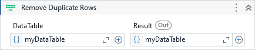

Removes the duplicate rows from a DataTable keeping only the first occurrence. Allows specify a limited number of columns for this comparison.

##### Properties

|Name     |Description                                                                                                                 |
|---------|----------------------------------------------------------------------------------------------------------------------------|
|Columns  |The column names or column indexes to be analyzed on duplicate rows comparison. Can be either a collection of string or int.|
|DataTable|The DataTable to remove duplicated rows.                                                                                    |
|Result   |The output DataTable with the distinct rows.                                                                                |

##### Usage

The activity will remove all duplicate columns from a DataTable by testing the values of all columns. However, we can also provide a limited number of columns for this check by specifying them on `Columns` property.
