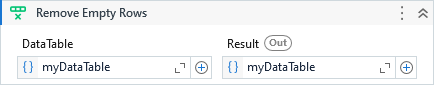

Removes the empty rows from a DataTable.

##### Properties

|Name     |Description                                                                                                                                                               |
|---------|--------------------------------------------------------------------------------------------------------------------------------------------------------------------------|
|Columns  |The column indexes or column names to verify.                                                                                                                             |
|DataTable|The input DataTable.                                                                                                                                                      |
|Mode     |Determines when a row should be removed. (All) means that all columns must be empty to remove the row. (Any) for any column empty and (Custom) for the user defined rules.|
|Operator |Determines the evaluation condition for the specified columns where (And) checks if all columns are empty and (Or) checks if any of the columns are empty.                |
|Result   |The output DataTable.                                                                                                                                                     |

##### Usage

It can be used in 3 different ways, set by `Mode` property. 
Check the description of each on the properties table above.

Let's consider the following DataTable except for the first column which is being used here just for reference:

| \# (ref-only) | Country (or dependency) | Population (2020) | Yearly Change | Net Change | Density (P/Km²) |
| ------------- | ----------------------- | ----------------- | ------------- | ---------- | --------------- |
| 1             | China                   | 1,439,323,776     |               | 5,540,090  |                 |
| 2             | India                   | 1,380,004,385     | 0.99 %        |            | 464             |
| 3             | United States           | 331,002,651       | 0.59 %        | 1,937,734  | 36              |
| 4             |                         |                   |               |            |                 |
| 5             | Pakistan                | 220,892,340       | 2.00 %        | 4,327,022  | 287             |
| 6             | Brazil                  | 212,559,417       | 0.72 %        | 1,509,890  | 25              |
| 7             | Nigeria                 | 206,139,589       |               | 5,175,990  | 226             |

- **All**

    In this mode, only the row 4 will be removed because all its values is empty/null.

- **Any**
  
    In this mode, the rows 1, 2, 4 and 7 will be removed because at least one of the columns is empty/null.

- **Custom**
  
    When we specify this mode, we need to work with `Columns` and `Operator` properties.

    Lets say that we want consider just the columns to decide if the row should be removed or not.

    `Columns = { "Yearly Change", "Density (P/Km²)" }`

    The `Operator` says how we want to evaluate these columns:

    - **And** - Means that *"Yearly Change"* **AND** *"Density (P/Km²)"* must be empty to remove the row which in this case will remove the rows 1 and 4.

    - **Or** - Means that *"Yearly Change"* **OR** *"Density (P/Km²)"* must be empty to remove the row which in this case will remove the rows 1, 4 and 7.

