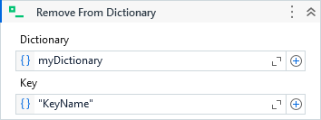

Removes the value with the specified key from the Dictionary.

##### Properties

|Name      |Description                                           |
|----------|------------------------------------------------------|
|Dictionary|The Dictionary where the element will be removed from.|
|Key       |The key of the element to remove.                     |

##### Usage
