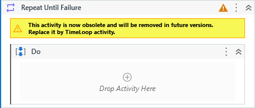

Repeats an action until an exception occur or the maximum number of repetitions is reached.

##### Properties

|Name              |Description                                                                                                           |
|------------------|----------------------------------------------------------------------------------------------------------------------|
|Body              ||
|IterationNumber   |The current iteration that was being processed. You can use it to determine in which iteration the process has broken.|
|LoopInterval      |The amount of time between each loop iteration.                                                                       |
|MaximumRepetitions|The maximum number of repetitions to stop the loop in case no exception occur. If not set, its default value is 300.  |
|OutputException   |The exception which caused the loop break. This result can be null in case of no exceptions did occur.                |

