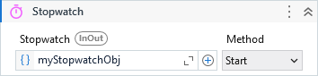

Provides a set of methods and properties that you can use to accurately measure elapsed time.

##### Properties

|Name     |Description                                                                   |
|---------|------------------------------------------------------------------------------|
|Method   |Determines which method must be invoked by activity.                          |
|Stopwatch|A variable that represents the instance of System.Diagnostics.Stopwatch class.|

##### Usage

Stopwatch is usually used for execution time tests.

This activity is just a handy way to initialize the `System.Diagonistics.Stopwatch` and work with its different methods.

Read more about the Stopwatch class at <a href="https://docs.microsoft.com/en-us/dotnet/api/system.diagnostics.stopwatch?view=net-6.0" target="_blank">Microsoft Docs</a>
