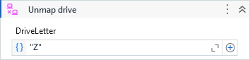

##### Properties

|Name           |Description                                                         |
|---------------|--------------------------------------------------------------------|
|DriveLetter    |The drive letter of the mapped drive.                               |
|ResponseCode   |The response code of the WNetCancelConnection2A.                    |
|ResponseMessage|The equivalent response message of the response code.               |
|Result         |Returns true if the drive was successfully unmapped, false otherise.|

