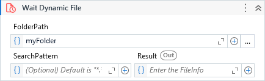

Waits until an unknown file be available by monitoring a specified folder.

##### Properties

|Name           |Description                                                                                                                                                                                                                                                                                    |
|---------------|-----------------------------------------------------------------------------------------------------------------------------------------------------------------------------------------------------------------------------------------------------------------------------------------------|
|ContinueOnError|If set, continue executing the remaining activities even if the current activity has failed.                                                                                                                                                                                                   |
|FolderPath     |The directory to be monitored.                                                                                                                                                                                                                                                                 |
|FromDateTime   |Considers only the files whose last write time is greater than this value. If is not set, the value used is the same as the last write time of the most recent file in the folder. If the folder is empty, the current date and time is used.                                                  |
|Interval       |Specifies the amount of time (in milliseconds) for the file re-check. Any value less than 50 will be clamped to 50. Make sure to keep this value lesser than Timeout value.                                                                                                                    |
|Result         |The FileInfo object of the respective file when found.                                                                                                                                                                                                                                         |
|SearchPattern  |The search string to match against the names of files in path. This parameter can contain a combination of valid literal path and wildcard (\* and ?) characters, but it doesn't support regular expressions. It supports a string or a collection of strings. Default value is all files (\*.\*).|
|Timeout        |The maximum time to wait (in milliseconds) the operation to complete.                                                                                                                                                                                                                          |

    
##### Usage

We can use this activity when we need to wait for a file be available which we *don't know* what is the file name.

The activity monitors a specific folder and as soon as a file become available considering all parameters specified in the activity, it returns the information of the file.

!!! note
    For files that you **can** determine the name, [Wait File](Wait File.md) suits better.
