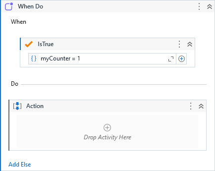
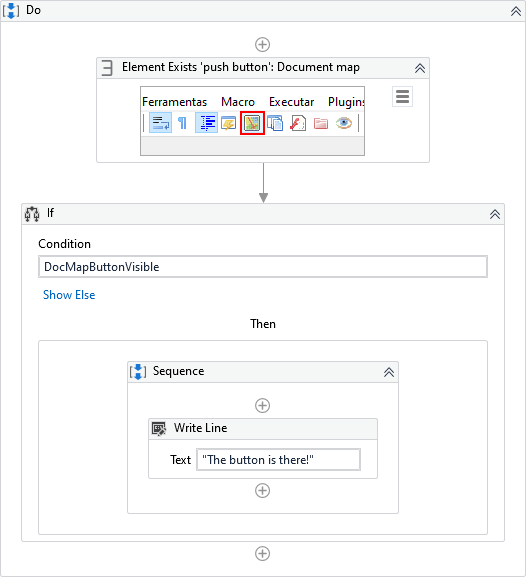
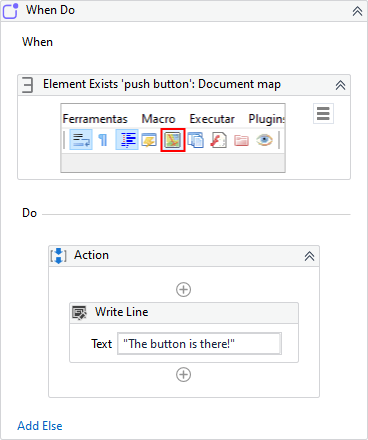
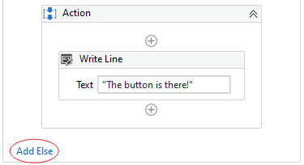
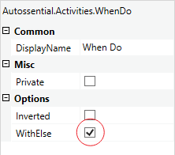
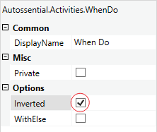
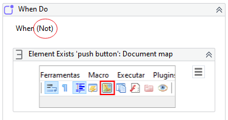

Executes the 'Do' block if the condition activity returns true.

##### Properties

|Name    |Description                                             |
|--------|--------------------------------------------------------|
|Inverted|Inverts the condition of the when test.                 |
|WithElse|Toggles the 'Else' block activating or deactivating it. |

##### Usage

The **When Do** works like an If statement but in this case, the condition is not an expression but another activity that returns a boolean value. E.g: [Is True](Is True.md), Element Exists, etc.

See the below different approachs:

=== "Element Exists & If"

    

=== "When Do"
    
    

        

        
In this case, there is no need to create any output variable for Element Exists activity.

    

---

The activity can also have an Else block which can be added by simply clicking on the link button:

Or by toggling it via *WithElse* property on properties window:

By default **When Do** expects a *True* condition but we can invert it by toggling the option *Inverted* on properties window.

The design will be updated with "(Not)" suffix to help us easily identify inverted conditions.

