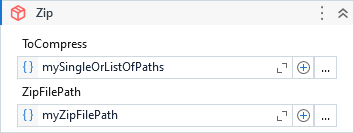

Compress files into a zip archive.

##### Properties

|Name            |Description                                                                                                                                                                                                                                     |
|----------------|------------------------------------------------------------------------------------------------------------------------------------------------------------------------------------------------------------------------------------------------|
|CompressionLevel|One of the enumeration values that indicates whether to emphasize speed or compression.                                                                                                                                                         |
|FilesCount      |Returns the amount of files added to zip archive.                                                                                                                                                                                               |
|ShortEntryNames |When true, reduces the entry names when it is coming from different root paths.                                                                                                                                                                 |
|TextEncoding    |The encoding to use when writing entry names in this archive. Specify a value for this parameter only when an encoding is required for interoperability with zip archive tools and libraries that do not support UTF-8 encoding for entry names.|
|ToCompress      |The path of the file(s) or folder(s) that will be compressed. Can be a string or a collection of strings.                                                                                                                                       |
|ZipFilePath     |The path of the zip archive.                                                                                                                                                                                                                    |

##### Usage

You can specify a single or multiple files and folders to be compressed on `.ToCompress` property:

Compressing specific files:

- `"C:\Temp\file1.docx"`
- `{ "C:\Temp\file1.docx", "C:\Temp\file2.xlsx" }`

Compressing folders:

- `"C:\Temp\Documents"`
- `{ "C:\Temp\Documents", "C:\Temp\Images", "C:\Temp\Musics" }`

Mixing Files and Folders:

- ` { "C:\Temp\file1.docx", "C:\Temp\Musics", "C:\Temp\Images\avagar.png" }`
