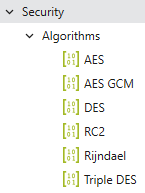
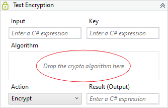

# Algorithms

List of algorithms to perform the encryption/decryption.

The new activities [Text Encryption](Text Encryption.md) and [DataTable Encryption](DataTable Encryption.md) are composite activities and requires that we specify an algorithm for them.

All the algorithms has a property called *Iterations* which is by default 1000 and determines the number of iterations for the encryption/decryption operation.

This value of 1000 is the minimum recommended.

The *UiPath.Cryptography.Activities* uses a iteration value of 10000 which is slower but also makes the encryption stronger.

The Autossential's solution is fully compatible with UiPath's solution, just make sure to encrypt/decrypt using a iteration of 10000 on the algorithm used.

!!! note

    The AES GCM algorithm is currently only available for Windows (.NET 5) versions.
    You will not find it listed on Windows Legacy (.NET Framework 4.61) versions.