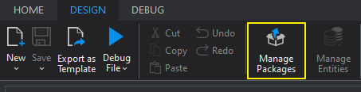
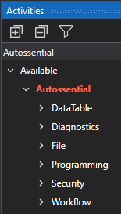

# Getting Started (UiPath)

For this documentation, the screenshots refers to UiPath Community 2021.10.3. Your interface may differ dependent of the version that you are using.

## New Project

The Autossential 3.x or above is compatible with Windows and Windows Legacy. 

## Installing Autossential

Once in your project, click on manage packages.

Search for Autossential, and install the Autossential.Activities package.

Now you should be able to find the Autossential category in the Activites panel:

