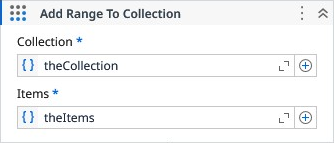

# Add Range To Collection

Adds a set of items to the specified collection.

### Properties

| Name | Description | Required |
|------|-------------|----------|
| Collection | The collection to be modified. | ✓ |
| Items | The items to be added to the collection. | ✓ |

