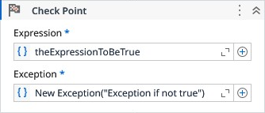

# Check Point

Checks if a given expression is true, if is not, thrown the specified exception.

### Properties

| Name | Description | Required |
|------|-------------|----------|
| Expression | The expression to be evaluated. | ✓ |
| Exception | The exception to throw if the expression is not true. | ✓ |
| Data | A collection of key/value pairs that provide additional user-defined information about the exception. |  |

