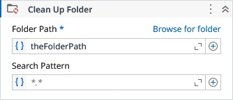

# Clean Up Folder

Deletes all files and folders from a specified folder.

### Properties

| Name | Description | Required |
|------|-------------|----------|
| Folder Path | The folder path to be cleaned up. | ✓ |
| Search Pattern | The search string defines file name patterns in the path. It supports literal text and wildcards (*, ?, !, \|), but not regular expressions. Use ! for exclusions (e.g., !*.txt), and \| for multiple patterns (e.g., *.png\|*.gif\|*.jpeg). Default is *.* (all files). |  |
| Files Deleted | The number of files that were deleted. |  |
| Folders Deleted | The number of folders that were deleted. |  |
| Last Write Time | Deletes only the files with last write time till this reference date. Default is DateTime.Now. |  |
| Delete Empty Folders | Determines if the left empty folders after files deletion must also be deleted. |  |
| Search Option | Specifies whether the search operation should include only the current directory or should include all subdirectories. |  |
| Continue on error | Specifies to continue executing the remaining activities even if the current activity failed. Only boolean values are allowed. |  |

