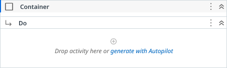
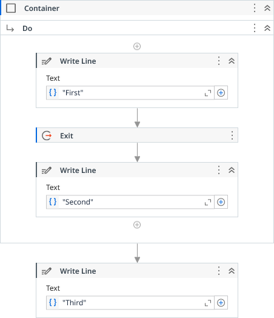
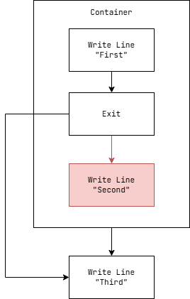
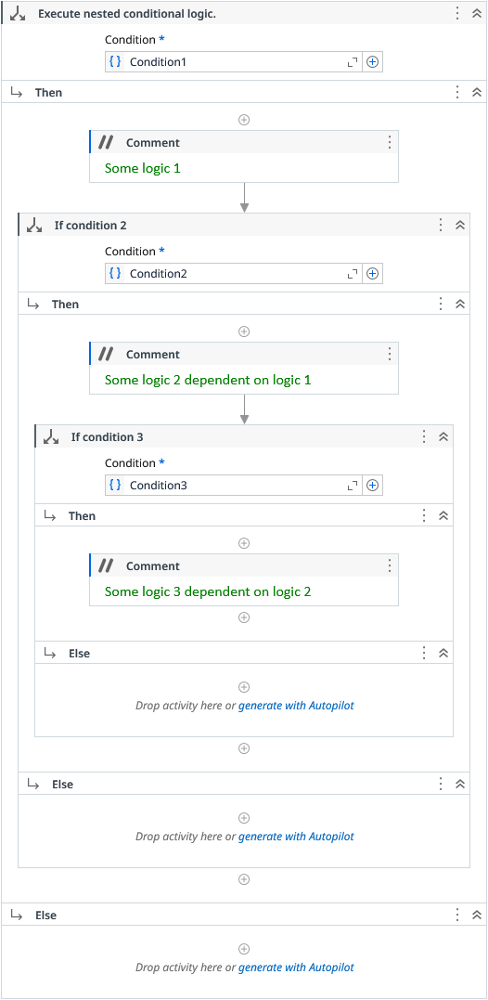
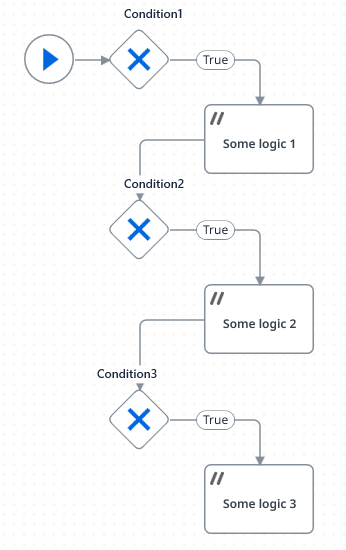
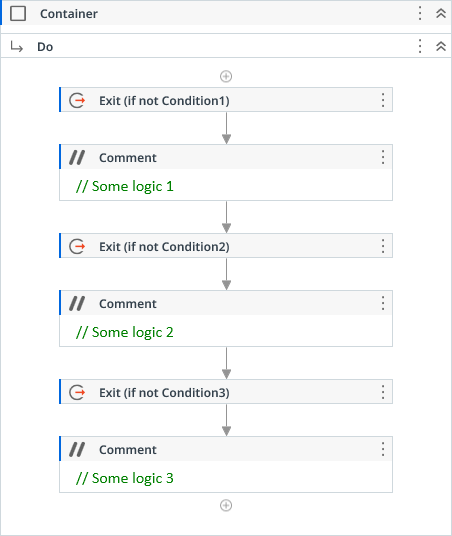

# Container

Its a wrapper that when combined with Exit Activity, interrupts the children execution flow exiting the Container beforehand.

### Usage

The **Container** activity has no effect if not combined with [Exit](Exit.md) activity.

With these two activities, we can avoid nested conditional Ifs or exit early from a workflow wrapped in a **Container**.

Consider the below code:

Only the messages *"First"* and *"Third"* will be printed out.

Based on its condition, the **Exit** activity tells to **Container** interrupt its execution. Then, the process flow continues to the next activity.

Below is an abstraction of what happens to the execution flow:

Everything that is below the **Exit** activity and inside the **Container** will be ignored/skipped and the execution flow will continue to the next activity after the **Container**.

This is very useful to avoid nested Ifs and to exit early from a workflow when certain conditions are not met.

=== "Nested Ifs"

	

=== "Flow Chart"

	

=== "Container & Exit"

	

