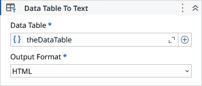

# Data Table To Text

Returns a string representation of a datatable on the specified text format (HTML, JSON or XML).

### Properties

| Name | Description | Required |
|------|-------------|----------|
| Data Table | The DataTable. | ✓ |
| Output Format | The output text format. | ✓ |
| Date Time Format | The date format to be used on the string representation for DateTime types. |  |
| Result | The string representation of the DataTable. |  |

