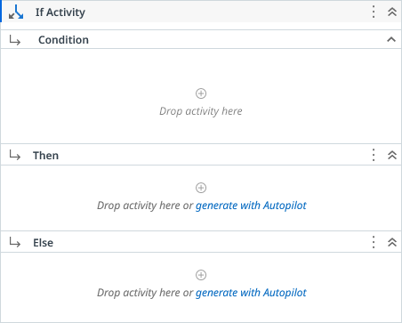

# If Activity

Evaluates the result of a boolean-returning activity and executes the associated code block if the condition is met.

### Properties

| Name | Description | Required |
|------|-------------|----------|
| Condition | A boolean-returning activity to be evaluated. |  |
| Then | Executes a set of child activities in a single, defined order. |  |
| Else | Executes a set of child activities in a single, defined order. |  |

