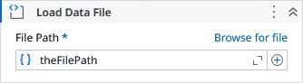

# Load Data File

Parses a JSON or YAML file into a DataNode for simplified access and manipulation.

### Properties

| Name | Description | Required |
|------|-------------|----------|
| File Path | The path to the JSON or YAML file to be loaded. | ✓ |
| Encoding | Specifies the text encoding used when reading the file. Defaults to UTF-8. |  |
| Culture | Specifies the culture used when converting node values to numeric types (e.g., int, long, double, decimal). |  |
| Result | The DataNode generated from the parsed file content. |  |

!!! info "Result"
	Read more about [DataNode](models/DataNode.md) resulting type.
