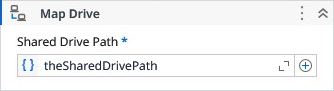

# Map Drive

Maps a Network Drive into the system.

### Properties

| Name | Description | Required |
|------|-------------|----------|
| Shared Drive Path | The shared drive path to connect with. | ✓ |
| Credential | Specifies the NetworkCredential object containing the username, password, and optionally the domain to authenticate the user when mapping the network drive. Required for protected shared folders. |  |
| Force | Tries to force the connection if the drive letter is already being in use. |  |
| Drive Letter | Specifies the drive letter to be mapped. If not provided, a random available letter will be assigned. The expected format is <letter><colon>, for example: "X:", "y:", "Z:". |  |
| Mapped Drive | The mapped drive letter if the mapping was successful, it is represented in the format "<letter>:". |  |
| Response Code | Represents the return code of the drive mapping operation. This value indicates whether the operation succeeded or failed, according to the standard Windows error codes. |  |
| Response Message | Provides the textual description corresponding to the response code. This message explains the result of the operation in a human‑readable format. |  |
| Result | Returns true if the drive was successfully mapped, false otherwise. |  |

