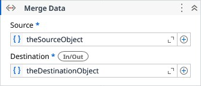

# Merge Data

Merges the source DataNode into the destination one. Scalar and Sequence values from source overwrite existing ones in destination. Map values are merged recursively.

### Properties

| Name | Description | Required |
|------|-------------|----------|
| Source | The DataNode to merge into the destination instance. | ✓ |
| Destination | The DataNode to be updated with source instance. | ✓ |

!!! info "Result"
	Read more about [DataNode](models/DataNode.md) resulting type.
