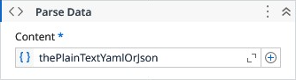

# Parse Data

Parses JSON or YAML input into a DataNode for simplified access and manipulation.

### Properties

| Name | Description | Required |
|------|-------------|----------|
| Content | The JSON or YAML text to be parsed into a DataNode. | ✓ |
| Culture | Defines the culture information applied during value conversions (such as int, long, double, or decimal) within the DataNode. |  |
| Result | The resulting DataNode created from the parsed JSON or YAML content. |  |

!!! info "Result"
	Read more about [DataNode](models/DataNode.md) resulting type.
